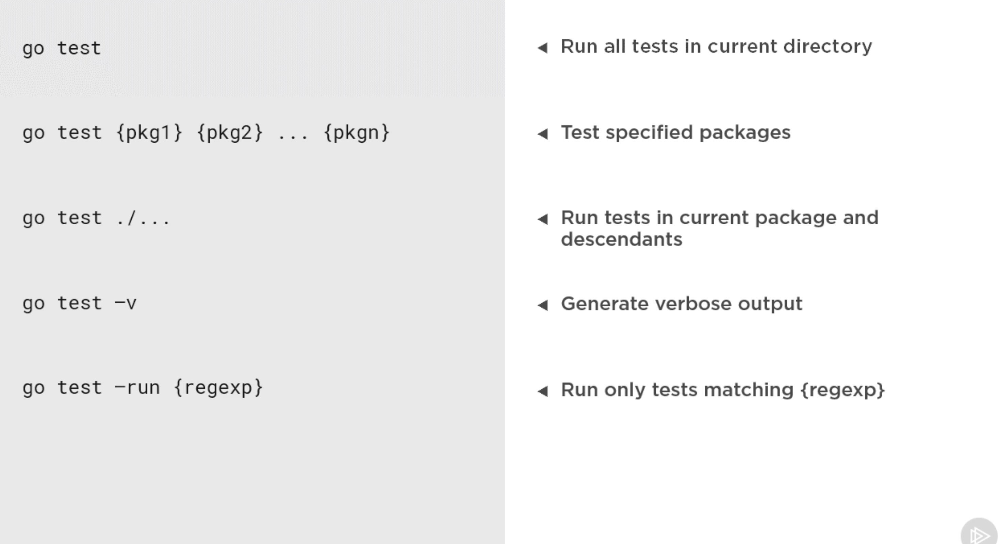
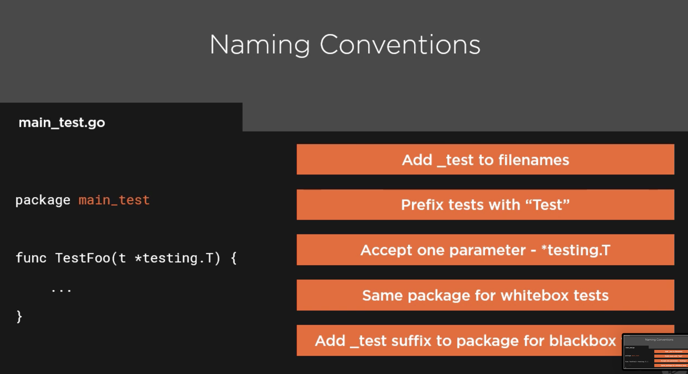
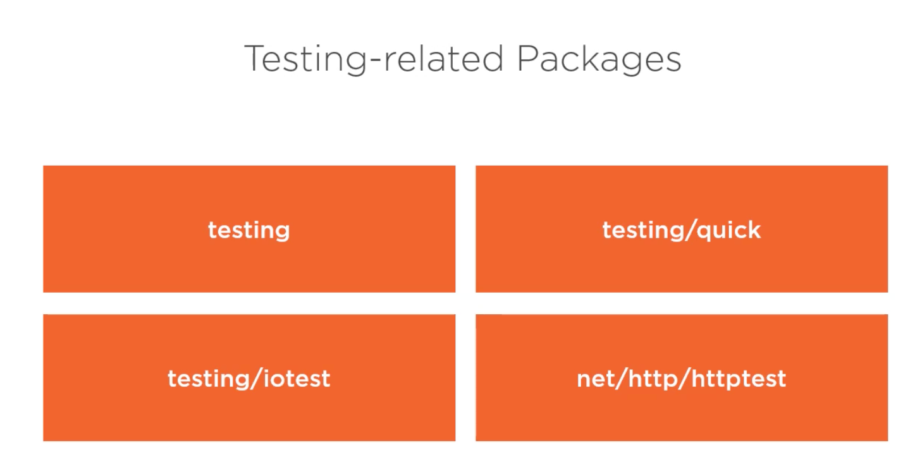
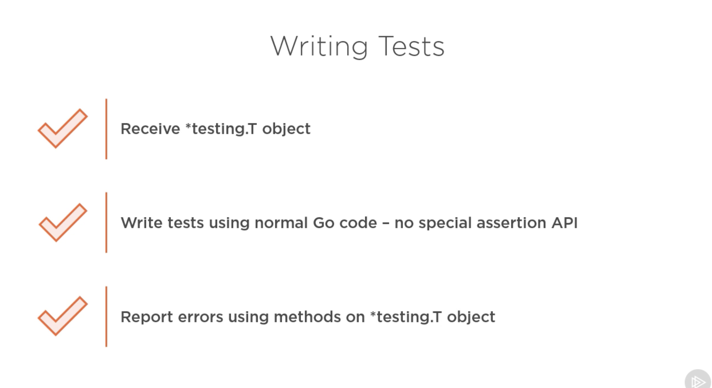
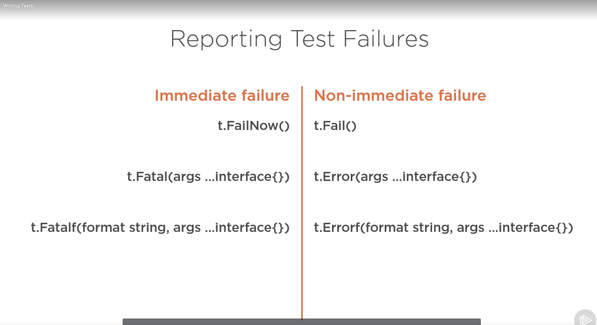

# Credit

Images & everything that I learned came from 

# Unit Testing in Golang


This program & documentation will display how to write "Tests" & "Benchmark" tests from the picture above. Documentation tests sound super intersting, so looking forward to learning that.

# Fundamentals

In order for go to pick up on which projects are unit test projects, you must go the with _test suffix naming convention:

```
{project_name}**_tests**
```
### Commands to run tests




```bash
# Run basic tests
go test

# Get results of of all tests instead of failed ones
go test -v

# See the code coverage of your tests
go test -cover

# Generate code coverage & analyze the coverage file
go test -coverprofile cover.out
go tool cover -func cover.out
go tool cover -html cover.out # run it in a browser as well!
go test -coverprofile count.out -covermode count # Get the count of how many times the function has been tested
go tool cover -html count # Check the count.out
```


## Prereqs
- You must name the test file after the file you are testing and use the _test ***suffx*** after that file
- You must have the Test ***prefix*** in your function in order for the function to be picked up as a test
- Use the same package that your code resides in for whitebox testing. This allows you to use the functions inside of the package.
- Use the _test prefix on your package to do blackbox testing. This says what package you are testing, but you don't get the internals of that package.




## Best Practices

- According to the plural sight instructor, it is best practice to put your tests in the same folder as the source code you are testing.
- If you are writing integration or e2e testing, you should NOT do this. Create a separate folder for this.


## Testing Related Packages

### Packages included in the standard library



- testing
    - The home for all written tests.
- testing/quick
    - Designed to simply black box testing. Writing a test where you don't care about internals of what you are testing against, just the results
- testing/iotest
    - Contains readers and writers that act like very specific aspects of a reader or writer
- net/http/httptest
    - Allows you to simulate requests, response recorders to write assertions against this or even test servers to do real e2e testing

### Community driven packages

- Testify
    - Provides the complete assertion experience if you like writing those
- Ginkgo
    - BDD style testing
- GoConvey
    - Generates results in a browser based format
- httpexpect
    - Designed to simplify e2e testing & popular to use with rest apis
- gomock
    - Simplifys the creation  of mocks that you can inject into tests, so that functionality of a related component won't bleed into it
- go-sqlmock
    - In memory mock database

# Writing Unit Tests





## Types of failures

- t.Error: Signals a failed test, but doesn't stop the rest of the test from executing
- t.Fatal: Fatal will fail the test and stop the execution

Example:

```go
func TestFailureTypes(t *testing.T) {
    t.Error("Signals a failed test, but doesn't stop the rest of the test from executing")
    t.Fatal("Fatal will fail the test and stop the execution")
    t.Error("This will never print since it is preceeded by an immediate failure")
}
```
