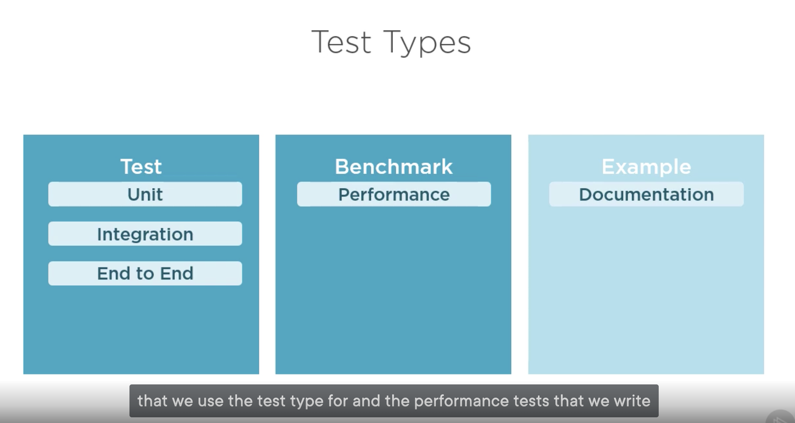

# Credit

Images & everything that I learned came from 

# Unit Testing in Golang



This program & documentation will display how to write "Tests" & "Benchmark" tests from the picture above. Documentation tests sound super intersting, so looking forward to learning that.

# Fundamentals

In order for go to pick up on which projects are unit test projects, you must go the with _test suffix naming convention:

```
{project_name}**_tests**
```

### Command to run tests

```go
go test
```

## Prereqs
- You must name the test file after the file you are testing and use the _test ***suffx*** after that file
- You must name the test packge after the package your code resides in with the _test ***suffix***
- You must have the Test ***prefix*** in your function in order for the function to be picked up as a test

## Testing Related Packages

### ackages included in the standard library


- testing
    - The home for all written tests.
- testing/quick
    - Designed to simply black box testing. Writing a test where you don't care about internals of what you are testing against, just the results
- testing/iotest
    - Contains readers and writers that act like very specific aspects of a reader or writer
- net/http/httptest
    - Allows you to simulate requests, response recorders to write assertions against this or even test servers to do real e2e testing

### Community driven packages

- Testify
    - Provides the complete assertion experience if you like writing those
- Ginkgo
    - BDD style testing
- GoConvey
    - Generates results in a browser based format
- httpexpect
    - Designed to simplify e2e testing & popular to use with rest apis
- gomock
    - Simplifys the creation  of mocks that you can inject into tests, so that functionality of a related component won't bleed into it
- go-sqlmock
    - In memory mock database
